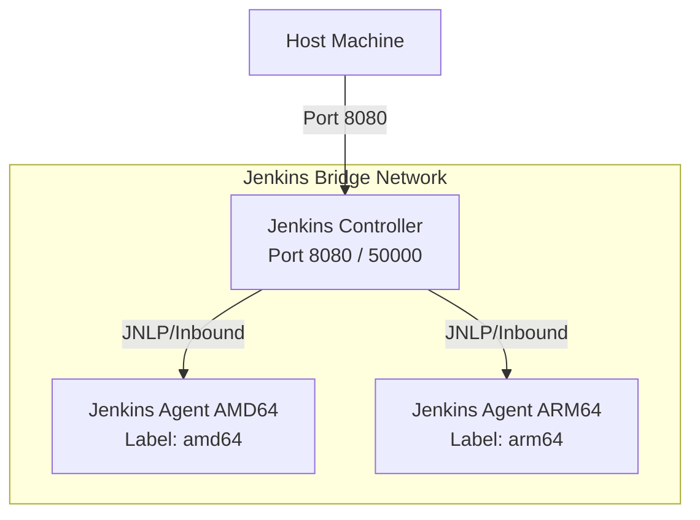

# Jenkins Dockerized Playground

A fully self-contained, dockerized Jenkins playground designed for experimenting with Jenkins configuration, multi-architecture agents (nodes), Job DSL, and declarative Groovy pipelines. All of this runs locally without requiring any local Jenkins or Java installation.

## Purpose

The main goals of this playground are:
1. **Zero-Install Setup**: Spin up a fully configured Jenkins controller and build agents using Docker and Docker Compose.
2. **Infrastructure as Code**:
   - **Jenkins Configuration as Code (JCasC)**: Pre-configure Jenkins settings, credentials, security, and agent nodes automatically upon startup.
   - **Job DSL**: Programmatically define and generate Jenkins pipeline jobs using Groovy scripts.
3. **Multi-Architecture Execution**: Spin up agents for both `AMD64` and `ARM64` architectures to experiment with cross-platform builds and target-specific agent scheduling.
4. **Groovy Pipelines**: Write and test robust declarative and scripted pipelines using Jenkinsfiles/Groovy.

---

## Architecture Overview

The playground consists of a central Jenkins controller and multiple agent nodes running in separate containers, orchestrated via Docker Compose:



### Components

1. **Jenkins Controller (Master)**:
   - Based on the official `jenkins/jenkins:lts` image.
   - Pre-loaded with required plugins (Job DSL, Configuration as Code, Git, Pipeline, etc.).
   - Utilizes JCasC to load the controller's configuration on startup, creating agent configurations and a **Seed Job** automatically.
2. **AMD64 Agent Node**:
   - Docker container running the Jenkins inbound agent.
   - Configured with `platform: linux/amd64` to enforce AMD64 execution (via emulation if running on an ARM host).
   - Node Label: `linux-amd64` or `amd64`.
3. **ARM64 Agent Node**:
   - Docker container running the Jenkins inbound agent.
   - Configured with `platform: linux/arm64` to enforce ARM64 execution.
   - Node Label: `linux-arm64` or `arm64`.

---

## Folder Structure

```yaml

├── agent/                 # Jenkins agent Dockerfiles (amd64, arm64)
│   └── Dockerfile         # Common Jenkins agent Dockerfile
├── controller/
│   ├── Dockerfile         # Custom Jenkins controller image (plugin pre-installation)
│   └── plugins.txt        # Plugins list (JCasC, Job DSL, Pipelines, etc.)
├── jcasc/
│   └── jenkins.yaml      # JCasC definition (nodes, security, seed job)
├── dsl/
│   └── seed.groovy       # Seed job DSL script to generate pipelines
├── pipelines/
│   └── *.groovy          # Pipeline scripts
├── .gitignore            # Git ignore file
├── .env.dist             # Environment variables template
├── docker-compose.yml    # Defines controller and agent containers
└── Makefile              # Makefile for automation
```

## Quick Start

We provide a beautiful, self-documenting `Makefile` to control the entire workflow from the root directory of the project:

1. **Start Playground Stack** (automatically generates SSH keys and `.env` configs if missing!):
   ```bash
   make start
   ```
2. **Follow Master Logs**:
   ```bash
   make logs
   ```
3. **Follow Agent Logs**:
   ```bash
   make logs-agents
   ```
4. **Access Jenkins UI**:
   - URL: [http://localhost:8080](http://localhost:8080)
   - Credentials: `admin` / `admin`
5. **Recompile Groovy Pipelines**:
   - Run the **`seed-job`** in Jenkins manually whenever you modify local pipeline files!
6. **Stop Playground and Wipe State**:
   ```bash
   make stop
   ```

For a full list of commands, run:
```bash
make help
```
